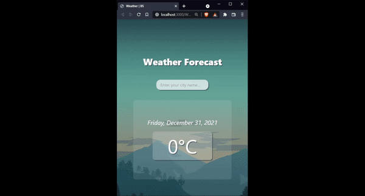

# Weather App

Open [/https://britoskies.github.io/WeatherApp](https://britoskies.github.io/WeatherApp/) to run the app.

## Description

Minimalist frontend application implementing React and Tailwind with the objective being to build a fast and simple weather forecast app.

Status: Finished  

## Tecnologies

<ul> 
    <li> React </li>
    <li> Tailwind CSS </li>
</ul>

## Available Scripts

In the project directory, you can run:

### `npm start`

Runs the app in the development mode.\
Open [http://localhost:3000](http://localhost:3000) to view it in your browser.

The page will reload when you make changes.\
You may also see any lint errors in the console.

